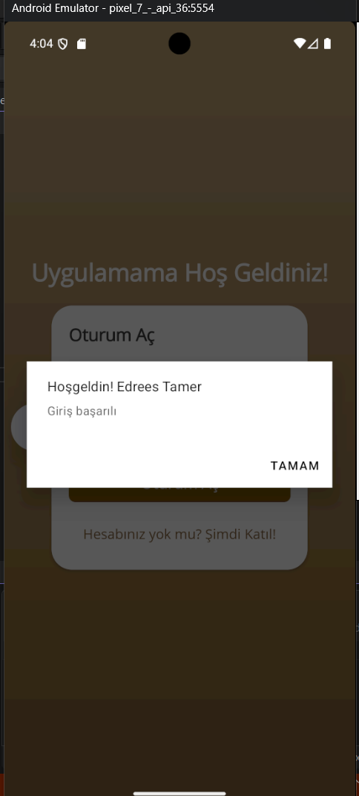
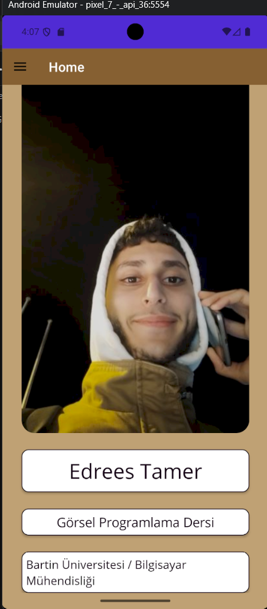
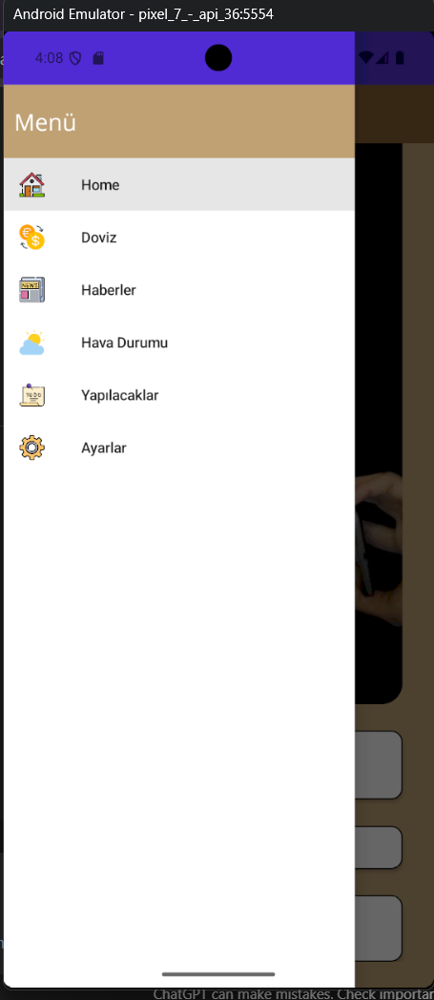
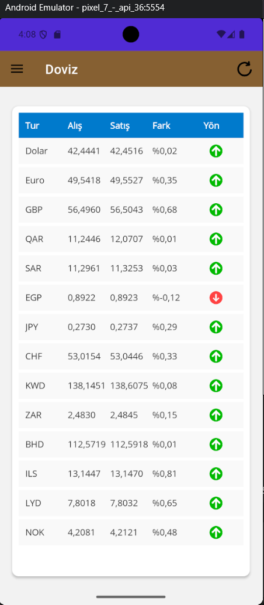
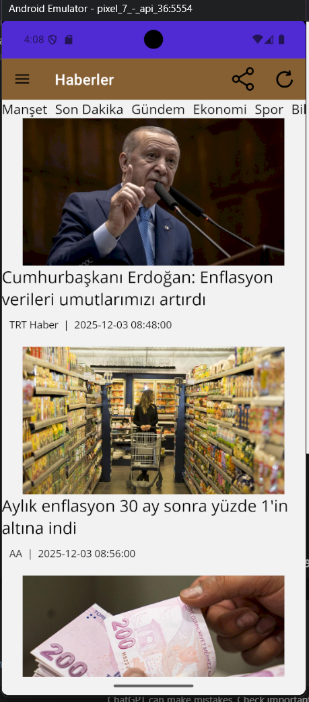
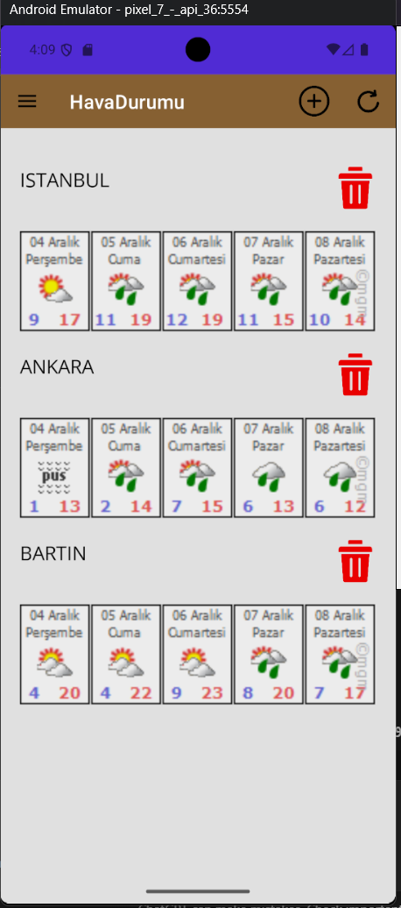
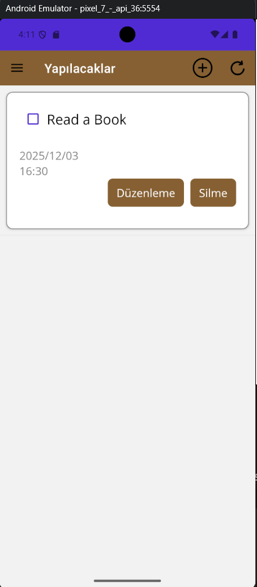
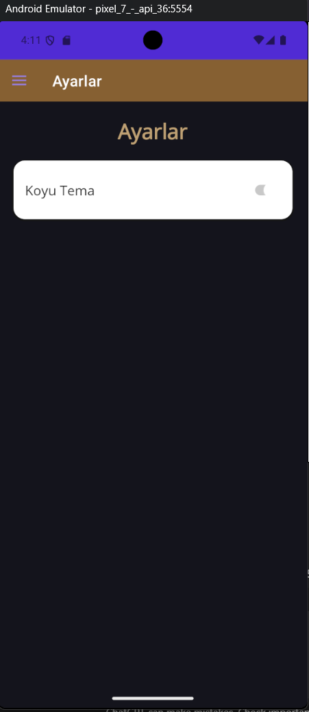

# EdreesApp 2024 – .NET MAUI Mobile App

EdreesApp 2024 is a cross-platform mobile application built with **.NET MAUI**.  
It was developed as part of a *Görsel Programlama* (Visual Programming) course and demonstrates a simple, modern mobile UI with navigation drawer, login, news, weather, currency and to-do features.

---

## Features

- **Login & welcome flow**
  - Email + password sign-in screen.
  - Custom welcome message dialog after successful login.

- **Home page**
  - Profile photo and personal information.
  - Course and university labels:
    - “Görsel Programlama Dersi”
    - “Bartın Üniversitesi / Bilgisayar Mühendisliği”

- **Side menu (Flyout)**
  - Drawer navigation with icons for:
    - Home  
    - Döviz (Currency)  
    - Haberler (News)  
    - Hava Durumu (Weather)  
    - Yapılacaklar (To-Do)  
    - Ayarlar (Settings)  

- **Currency page (Döviz)**
  - Table of exchange rates (buy/sell, change, direction).
  - Visual arrows to show price movement.

- **News page (Haberler)**
  - News feed style UI with images, title, source and date.
  - Categories (Manşet, Son Dakika, Gündem, Ekonomi, Spor, …).

- **Weather page (HavaDurumu)**
  - Simple weather cards for cities such as Istanbul, Ankara, Bartın.
  - Add/remove city buttons prepared for future logic.

- **To-Do list (Yapılacaklar)**
  - Create tasks with title, date and time.
  - Edit and delete actions for each task.
  - Checkbox to mark items as completed.

- **Settings & Dark mode**
  - Settings page with “Koyu Tema” toggle.
  - Dark mode UI enabled when the switch is turned on.

---

## Tech Stack

- **Framework:** .NET 7, .NET MAUI  
- **Language:** C#  
- **IDE:** Visual Studio 2022  
- **Target platform:** Android (tested on Pixel 7 – API 36 emulator)  

---

## Screenshots

All screenshots are stored in the `images/` folder in this repository.

### Sign-in Page


---

### Welcome Dialog



---

### Main / Home Page



---

### Navigation Menu (Flyout)



---

### Currency Page – Döviz



---

### News Page – Haberler



---

### Weather Page – HavaDurumu



---

### To-Do List Feature – Yapılacaklar



---

### Dark Mode Feature



---

## How to Run

1. Install **.NET 7 SDK** and **Visual Studio 2022** with the  
   **“.NET Multi-platform App UI development”** workload.

2. Clone this repository:

   ```bash
   git clone https://github.com/edrees078/EdreesApp2024.git
